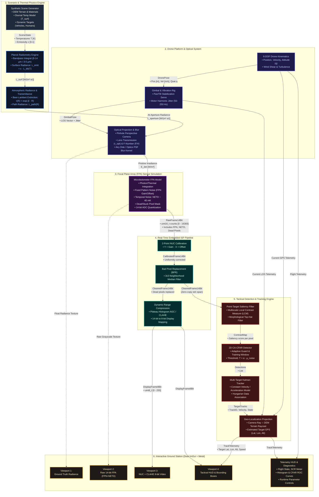
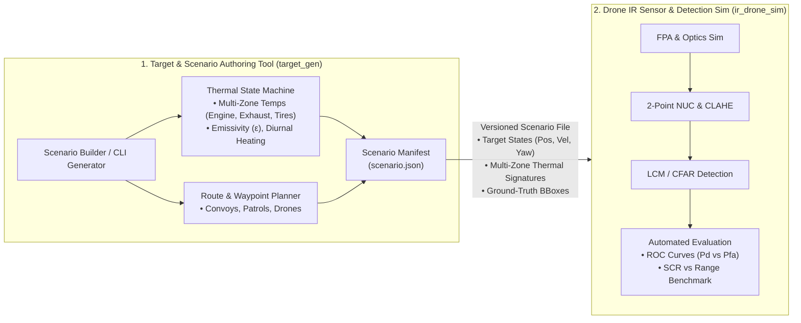

# Implementation Plan: Modern C++ (C++20) Passive IR Imaging & Detection Simulation for Drone Platforms

## 1. Executive Summary & Defense/Aerospace (Anduril) Alignment

This project designs and implements an end-to-end, high-performance **Passive Infrared (IR) Imaging, Sensor Degradation, and Target Detection Simulation** written in **Modern C++ (C++20)** using **Apple Clang** on macOS (Apple Silicon M4).

In defense edge-vision and autonomous systems (e.g. Anduril's Lattice, Ghost/Altius UAVs, Sentry Towers, and WISP panoramic thermal trackers), imaging software must balance:
1. **Rigorous IR Radiometry**: Physics-based radiative transfer, Planck blackbody integration, material emissivity, and atmospheric slant-range attenuation.
2. **True-to-Hardware FPA Artifacts**: Uncooled LWIR microbolometer dynamics, Fixed-Pattern Noise (FPN / stripe noise), NETD thermal noise, and bad pixel clustering.
3. **Real-time Embedded ISP (Image Signal Processor)**: Two-point Non-Uniformity Correction (NUC), Bad Pixel Replacement (BPR), Dynamic Range Compression / Digital Detail Enhancement (DDE / CLAHE).
4. **Low-SCR Tactical Target Detection**: Point-target Local Contrast Measure (LCM), Morphological Top-Hat, and 2D Cell-Averaging Constant False Alarm Rate (CA-CFAR).
5. **Zero-Copy, High-Throughput C++20 Systems Architecture**: Cache-friendly data structures (`std::span`, memory arenas, SIMD-friendly layout), deterministic latency without dynamic heap allocations on the hot path, and thread-safe pipeline design.

---

## 2. Mathematical & Physical Modeling Framework

### A. Radiometry & Thermal Emission
For any surface patch with temperature $T$ [K] and spectral emissivity $\epsilon(\lambda)$, the spectral radiant exitance is governed by Planck's Law:
$$M(\lambda, T) = \frac{2 \pi h c^2}{\lambda^5 \left(e^{\frac{h c}{\lambda k_B T}} - 1\right)} \quad [\text{W}\cdot\text{m}^{-2}\cdot\mu\text{m}^{-1}]$$

Over an optical bandpass $[\lambda_1, \lambda_2]$ (LWIR: $8-14\,\mu\text{m}$, MWIR: $3-5\,\mu\text{m}$), the in-band radiance is:
$$L_\text{in-band}(T) = \frac{1}{\pi} \int_{\lambda_1}^{\lambda_2} \epsilon(\lambda) M(\lambda, T) \, d\lambda \quad [\text{W}\cdot\text{m}^{-2}\cdot\text{sr}^{-1}]$$

At slant range $R$ from the drone with atmospheric transmittance $\tau_\text{atm}(R, \lambda)$ and path radiance $L_\text{path}$:
$$L_\text{aperture} = \tau_\text{atm}(R) \left[ L_\text{in-band}(T_\text{target}) + (1 - \epsilon) L_\text{ambient} \right] + L_\text{path}(R)$$

### B. Drone Optical & FPA (Focal Plane Array) Physics
1. **At-Detector Irradiance**:
   $$E_\text{det} = \frac{\pi \tau_\text{opt}}{4 F_\#^2} L_\text{aperture}$$
2. **IFOV & Ground Sample Distance (GSD)**:
   $$\text{IFOV} = \frac{\text{pixel\_pitch}}{f} \quad [\text{rad}], \qquad \text{GSD} = \frac{H \cdot \text{IFOV}}{\cos(\theta_\text{look})}$$
3. **Temporal Noise (NETD)**:
   Gaussian thermal fluctuations added per pixel: $\sigma_n = \text{NETD} \cdot \frac{\partial \text{Counts}}{\partial T}$.
4. **Spatial Fixed-Pattern Noise (FPN)**:
   Raw pixel response with non-uniform gain $g_{i,j} \sim \mathcal{N}(1.0, \sigma_g)$ and offset $o_{i,j} \sim \mathcal{N}(0.0, \sigma_o)$:
   $$\text{Raw}_{i,j} = g_{i,j} \cdot \text{Counts}_{i,j} + o_{i,j} + \mathcal{N}(0, \sigma_n)$$
5. **Defective Pixels**: Random dead (0 count) or stuck (saturated count) pixels ($0.1\%-0.5\%$).

### C. Onboard ISP & Detection Pipeline
1. **2-Point Non-Uniformity Correction (NUC)**:
   Using calibration frames at temperatures $T_\text{cold}$ and $T_\text{hot}$, compute per-pixel gain $G_{i,j}$ and bias $B_{i,j}$:
   $$\text{NUC}_{i,j} = G_{i,j} \cdot \text{Raw}_{i,j} + B_{i,j}$$
2. **Bad Pixel Replacement (BPR)**: 8-neighbor median replacement for flagged defective pixels.
3. **Dynamic Range Compression**: 14-bit radiometric count mapped to 8-bit display via plateau-equalized histogram / CLAHE.
4. **Point Target Detection (Local Contrast Measure - LCM)**:
   For sub-pixel / low-pixel targets, compute local contrast between central sub-block and surrounding 8-directional neighborhoods:
   $$\text{LCM}(x, y) = \min_k \frac{m_0^2}{m_k}$$
   where $m_0$ is maximum gray value in center cell, and $m_k$ is mean gray value in cell $k$.
5. **2D CA-CFAR**:
   Adaptive thresholding based on local background noise variance:
   $$T_\text{CFAR} = \alpha \cdot \frac{1}{N_\text{train}} \sum_{k \in \text{Train}} X_k$$

---

## 3. System Architecture & Key Data Flows

### A. High-Level Component Flowchart



### B. Concrete C++20 Data Structures & Zero-Copy Pipeline Flow

| Pipeline Stage | C++ Type / Structure | Payload Size & Format | Typical Rate | Zero-Copy Handling |
| :--- | :--- | :--- | :--- | :--- |
| **Pristine At-Aperture** | `ir_sim::core::FrameBuffer<float>` | $640 \times 512 \times 4\text{ B} = 1.31\text{ MB}$ (Radiance $\text{W}\cdot\text{m}^{-2}\cdot\text{sr}^{-1}$) | $30-60\text{ Hz}$ | Double-buffered memory arena |
| **Raw FPA Output** | `ir_sim::core::FrameBuffer<uint16_t>` | $640 \times 512 \times 2\text{ B} = 655\text{ KB}$ (14-bit ADC counts) | $30-60\text{ Hz}$ | Ring buffer (producer FPA $\to$ consumer ISP) |
| **NUC / BPR Corrected** | `ir_sim::core::FrameBuffer<uint16_t>` | $640 \times 512 \times 2\text{ B} = 655\text{ KB}$ (Linearized counts) | $30-60\text{ Hz}$ | In-place or ping-pong scratch buffer |
| **ISP Display Feed** | `ir_sim::core::FrameBuffer<uint8_t>` | $640 \times 512 \times 1\text{ B} = 327\text{ KB}$ (8-bit grayscale) | $30-60\text{ Hz}$ | Direct Metal Texture Blit via `MTLTexture::replaceRegion` |
| **Detection Output** | `std::vector<Detection>` (Pre-reserved cap: 256) | $256 \times 32\text{ B} = 8\text{ KB}$ (`x, y, w, h, scr, confidence`) | $30-60\text{ Hz}$ | Reused vector per frame (`clear()` without deallocating) |
| **Track State** | `std::vector<Track>` (Pre-reserved cap: 64) | State vector: $[x, y, z, \dot{x}, \dot{y}, \dot{z}]^T + \text{Covariance } \mathbf{P}_{6\times6}$ | $30-60\text{ Hz}$ | Kalman filter persistent state array |
| **Telemetry & GPS** | `ir_sim::core::TelemetryPacket` | $128\text{ B}$ POD struct (`lat, lon, alt, roll, pitch, yaw, jitter_rms`) | $60-120\text{ Hz}$ | Lock-free atomic snapshot for ImGui HUD |

### C. Key Pipeline C++ Interfaces

```cpp
namespace ir_sim {

// 1. FPA Transduction: Converts at-aperture radiance map to degraded 14-bit ADC counts
class FPASensor {
public:
    void process(std::span<const float> aperture_radiance,
                 std::span<uint16_t> out_raw_frame);
};

// 2. Real-Time Embedded ISP: Two-point NUC, bad-pixel repair, and dynamic range compression
class ISPPipeline {
public:
    void calibrate_2point(std::span<const uint16_t> cold_frame,
                          std::span<const uint16_t> hot_frame,
                          float temp_cold, float temp_hot);

    void correct_nuc_and_bpr(std::span<const uint16_t> raw_in,
                             std::span<uint16_t> corrected_out);

    void enhance_dynamic_range(std::span<const uint16_t> corrected_in,
                               std::span<uint8_t> display_out);
};

// 3. Tactical Detection: Multiscale LCM point-target filtering and 2D CA-CFAR
class DetectionEngine {
public:
    std::span<const Detection> detect(std::span<const uint16_t> cleaned_frame,
                                      float pfa_threshold);
};

// 4. Geo-Localization: Camera ray ∩ DEM ground projection
class GeoProjector {
public:
    GeoCoordinate pixel_to_gps(const DronePose& drone,
                               const GimbalPose& gimbal,
                               PixelCoord pixel);
};

} // namespace ir_sim
```

### D. Dual-Tool Decoupling: Standalone Target Generator (`target_gen`) & Sensor Simulator (`ir_drone_sim`)

To support deterministic regression testing, CI/CD benchmarking, and clean separation of concerns, the system is split into two standalone executables sharing the core physics/math libraries:



#### Standardized Scenario Manifest Schema (`scenario.json`)
```json
{
  "scenario_name": "woodland_convoy_dusk",
  "ambient_temperature_k": 288.15,
  "solar_irradiance_w_m2": 150.0,
  "atmospheric_visibility_km": 15.0,
  "targets": [
    {
      "id": 1,
      "type": "military_truck",
      "thermal_zones": {
        "engine_hood": { "temp_k": 348.0, "emissivity": 0.92 },
        "exhaust": { "temp_k": 485.0, "emissivity": 0.88 },
        "tires": { "temp_k": 315.0, "emissivity": 0.94 },
        "chassis": { "temp_k": 291.0, "emissivity": 0.90 }
      },
      "waypoints": [
        { "t_sec": 0.0,  "pos": [100.0, 250.0, 0.0], "speed_mps": 12.0 },
        { "t_sec": 10.0, "pos": [220.0, 250.0, 0.0], "speed_mps": 12.0 }
      ]
    }
  ]
}
```

---

## 4. Modern C++ (C++20) Engineering Standards

To demonstrate production-grade defense software craftsmanship:
- **C++20 Standard**: Concepts, `std::span` for zero-copy buffer views, designated initializers, `constexpr` math tables.
- **Memory Safety & Zero Heap Allocation in Hot Path**: Pre-allocated frame buffers, memory arenas, value semantics. No `malloc` or `new` in frame loops.
- **Hardware Acceleration (Apple Silicon / ARM64)**:
  - Vectorized math using ARM NEON intrinsics and compiler auto-vectorization (`-O3 -ffast-math`).
  - Cache-friendly contiguous row-major image buffers.
- **Build System**: Clean, modern CMake ($>= 3.25$) configured for Apple Clang with strict warnings (`-Wall -Wextra -Wpedantic -Wconversion -Werror`).
- **Dependencies**: Minimal, self-contained external dependencies (fetched cleanly via CMake `FetchContent` or standard system libraries):
  - Modern CMake configuration
  - Catch2 for unit testing
  - GLFW / Metal and Dear ImGui for real-time visualization
  - CLI benchmarking and telemetry logging tools

---

## 5. File Structure (Root: `/Users/fherman/Documents/Infrared-Imaging-Sim`)

```text
/Users/fherman/Documents/Infrared-Imaging-Sim/
├── CMakeLists.txt                      # Root modern CMake build configuration
├── docs/
│   └── implementation_plan.md          # Architecture, data flows, and glossary
├── include/
│   └── ir_sim/
│       ├── core/
│       │   ├── types.hpp               # Radiometric units, 14-bit FrameBuffer, Vec3, Quat
│       │   ├── memory_arena.hpp        # Zero-allocation frame buffer pool
│       │   └── logger.hpp              # Low-overhead real-time telemetry logger
│       ├── physics/
│       │   ├── planck.hpp              # Vectorized/constexpr Planck radiance & bandpass integration
│       │   ├── atmosphere.hpp          # Extinction coefficients & slant-range transmittance
│       │   └── materials.hpp           # Spectral emissivity and thermal inertia database
│       ├── platform/
│       │   ├── drone_state.hpp         # 6-DOF kinematics, waypoints, wind gust model
│       │   ├── gimbal.hpp              # Stabilized gimbal with high-frequency motor jitter
│       │   └── geo_projection.hpp      # Pinhole projection, GSD, ray-to-ground target localization
│       ├── sensor/
│       │   ├── optics.hpp              # Lens blur, Airy PSF kernel, F-number irradiance
│       │   ├── fpa_sensor.hpp          # Microbolometer FPA (NETD temporal noise, FPN, dead pixels)
│       │   └── isp_pipeline.hpp        # 2-point NUC, median bad pixel replacement, 14->8bit AGC
│       ├── detection/
│       │   ├── point_target_lcm.hpp    # Multiscale Local Contrast Measure (LCM)
│       │   ├── cfar_2d.hpp             # 2D Cell-Averaging / Order-Statistic CFAR
│       │   └── kalman_tracker.hpp      # Kalman filter target state & track association
│       └── scene/
│           ├── synthetic_scene.hpp     # Procedural thermal terrain, roads, structures
│           ├── thermal_targets.hpp     # Vehicles (engine/exhaust), personnel, dynamic kinematics
│           └── scenario_manifest.hpp   # JSON serialization / deserialization of scenario files
├── src/
│   ├── core/
│   │   └── types.cpp
│   ├── physics/
│   │   ├── planck.cpp
│   │   ├── atmosphere.cpp
│   │   └── materials.cpp
│   ├── platform/
│   │   ├── drone_state.cpp
│   │   ├── gimbal.cpp
│   │   └── geo_projection.cpp
│   ├── sensor/
│   │   ├── optics.cpp
│   │   ├── fpa_sensor.cpp
│   │   └── isp_pipeline.cpp
│   ├── detection/
│   │   ├── point_target_lcm.cpp
│   │   ├── cfar_2d.cpp
│   │   └── kalman_tracker.cpp
│   ├── scene/
│   │   ├── synthetic_scene.cpp
│   │   ├── thermal_targets.cpp
│   │   └── scenario_manifest.cpp
│   ├── tools/
│   │   └── target_gen_main.cpp         # Standalone Scenario & Target Generator binary (target_gen)
│   └── app/
│       ├── main_cli.cpp                # High-throughput benchmark & scenario runner
│       └── main_gui.cpp                # Real-time multi-viewport interactive simulator (ir_drone_sim)
├── scenarios/
│   ├── desert_convoy_day.json          # Pre-built version-controlled scenario manifests
│   └── woodland_search_night.json
└── tests/
    ├── test_planck_radiometry.cpp      # Planck integration accuracy & Stefan-Boltzmann check
    ├── test_atmosphere.cpp             # Transmission decay vs slant range
    ├── test_fpa_noise.cpp              # Statistical validation of NETD and FPN distribution
    ├── test_isp_pipeline.cpp           # NUC gain/offset recovery & BPR verification
    ├── test_detection_benchmark.cpp    # SCR vs Pd/Pfa ROC curve verification
    ├── test_scenario_manifest.cpp      # Target serialization / deserialization check
    └── test_geo_projection.cpp         # Target raycasting to GPS coordinates
```

---

## 6. Phased Implementation Roadmap

### Phase 1: Core Framework, Modern CMake & Physics Radiometry Engine
- Setup `CMakeLists.txt` with C++20 and strict Clang flags.
- Implement `ir_sim::core::FrameBuffer` (cache-aligned, zero-copy, float and uint16_t).
- Implement `ir_sim::physics::Planck`: Fast lookup / Simpson's quadrature integration of blackbody spectral radiance over LWIR (8-14µm) and MWIR (3-5µm).
- Implement `ir_sim::physics::Atmosphere`: Beer-Lambert slant-range attenuation and path radiance.
- **Deliverable**: Automated test suite verifying radiometric calculations against standard physical tables ($M = \sigma T^4$ verified to $<0.05\%$).

### Phase 2: Drone Platform Kinematics & Geo-Projection
- Implement 6-DOF drone kinematics (`ir_sim::platform::DroneState`) with waypoint navigation.
- Implement stabilized gimbal model with servo delay and motor vibration harmonics ($50-250\text{ Hz}$).
- Implement camera pinhole model, IFOV, GSD, and ground plane / DEM raycaster for target coordinate estimation.
- **Deliverable**: Unit tests verifying camera LOS, GSD scaling with altitude, and ground intersection accuracy.

### Phase 3: FPA Sensor Degradation & Onboard ISP Pipeline
- Implement `ir_sim::sensor::FPASensor`:
  - Temporal Gaussian NETD noise generator.
  - 2D Fixed-Pattern Noise (FPN) matrix generator (spatial column/row and pixel gain/offset non-uniformities).
  - Bad pixel mask (dead and hot pixels).
  - 14-bit ADC quantization.
- Implement `ir_sim::sensor::ISPPipeline`:
  - Calibration routine: Two-point NUC gain/offset extraction from cold and hot uniform frames.
  - Runtime 2-point NUC: $Y = G \cdot X + B$.
  - 8-neighbor Bad Pixel Replacement (BPR).
  - Dynamic Range Compression: Plateau histogram equalization / CLAHE converting 14-bit raw to 8-bit visual display.
- **Deliverable**: Tests demonstrating reduction of spatial noise index after NUC calibration and full bad-pixel removal.

### Phase 4: Tactical Target Detection & Tracking
- Implement `ir_sim::detection::PointTargetLCM`: Multiscale Local Contrast Measure for small/distant thermal signatures.
- Implement `ir_sim::detection::CFAR2D`: 2D Cell-Averaging Constant False Alarm Rate adaptive thresholding.
- Implement `ir_sim::detection::KalmanTracker`: Constant-velocity motion model with Mahalanobis / greedy track association.
- **Deliverable**: Detection benchmark verifying target detection rate ($P_d$) across varying Signal-to-Clutter Ratios (SCR $1.5$ to $10.0$).

### Phase 5: End-to-End Simulation Runner & Real-time Visualization
- Connect the full pipeline in an asynchronous, zero-copy architecture.
- High-throughput CLI runner with automated scenario execution, telemetry logging, and CSV/image output.
- Interactive visualization with multi-viewport display (Ground Truth, Raw 14-bit FPA, Calibrated NUC 8-bit, Tactical Detection HUD).

---

## 7. Glossary of Acronyms & Defense/Thermal Imaging Terminology

| Acronym | Full Expansion | Category | Description & Context in this System |
| :--- | :--- | :--- | :--- |
| **ADC** | Analog-to-Digital Converter | Sensor Electronics | Hardware circuit digitizing detector analog voltages into digital numbers (14-bit: $0-16383$ counts). |
| **AGC** | Automatic Gain Control | Image Processing | Algorithm adjusting the dynamic range of an image to optimize contrast for display or downstream computer vision. |
| **AGL** | Above Ground Level | Flight Dynamics | Drone altitude measured relative to the terrain directly beneath it (as opposed to MSL - Mean Sea Level). |
| **BBox** | Bounding Box | Computer Vision | Rectangular coordinate box $[x, y, w, h]$ enclosing a detected target. |
| **BPR** | Bad Pixel Replacement | Embedded ISP | Algorithmic replacement of non-responsive (dead) or saturated (hot) FPA detector elements using neighboring pixel medians. |
| **CA-CFAR** | Cell-Averaging Constant False Alarm Rate | Detection & Radar/EO | Adaptive detection technique that dynamically calculates the local clutter threshold by averaging surrounding reference cells. |
| **CFAR** | Constant False Alarm Rate | Detection & Radar/EO | Class of adaptive thresholding algorithms maintaining a fixed probability of false alarm ($P_\text{fa}$) in non-stationary noise. |
| **CLAHE** | Contrast Limited Adaptive Histogram Equalization | Image Processing | Local adaptive contrast enhancement algorithm preventing over-amplification of noise in homogeneous thermal regions. |
| **DDE** | Digital Detail Enhancement | Image Processing | FLIR/defense term for high-dynamic-range compression separating low-frequency scene dynamics from high-frequency target detail. |
| **DEM** | Digital Elevation Model | GIS & Navigation | 2.5D or 3D digital representation of terrain surface topography used for drone collision avoidance and raycast geo-localization. |
| **DN** | Digital Number | Radiometry & Sensing | The raw, uncalibrated integer value output by an ADC pixel (e.g. 14-bit count from 0 to 16,383). |
| **DOF** | Degrees of Freedom | Kinematics | The 6 independent spatial coordinates defining drone state: translation $(x, y, z)$ and rotation $(\text{roll}, \text{pitch}, \text{yaw})$. |
| **DTED** | Digital Terrain Elevation Data | Defense GIS | Military standard raster elevation data format developed by NGA (National Geospatial-Intelligence Agency). |
| **EIS** | Electronic Image Stabilization | Video Processing | Software compensation for camera shake/vibration using optical flow and IMU telemetry without moving mechanical parts. |
| **EKF** | Extended Kalman Filter | Estimation & Tracking | Non-linear state estimator widely used in drone navigation and 3D kinematic target tracking. |
| **EO/IR** | Electro-Optical / Infra-Red | Defense Payloads | Combined multispectral sensor suite featuring visible daylight optics (EO) alongside thermal infrared detectors (IR). |
| **FOV** | Field of View | Optics | The total angular extent of the observable world visible through the camera lens (e.g., $32^\circ \times 24^\circ$). |
| **FPA** | Focal Plane Array | Sensor Hardware | The two-dimensional grid of photodetector elements located at the focal plane of the camera optical lens. |
| **FPN** | Fixed Pattern Noise | Sensor Physics | Spatial non-uniformity across FPA pixels caused by micro-manufacturing variations in detector gain and offset (visible as striping). |
| **GCS** | Ground Control Station | Drone Operations | Software system and terminal used by operators to command UAV flight paths, monitor telemetry, and view sensor video. |
| **GSD** | Ground Sample Distance | Remote Sensing | The physical distance on the ground represented by the center-to-center distance between adjacent pixels (e.g., $10\text{ cm/pixel}$). |
| **HUD** | Heads-Up Display | UI / Telemetry | Transparent tactical overlay displaying platform attitude, airspeed, sensor crosshairs, and target tracking vectors. |
| **IFOV** | Instantaneous Field of View | Optics | The angular cone subtended by a single detector pixel: $\text{IFOV} = \text{pixel\_pitch} / f$. |
| **IMU** | Inertial Measurement Unit | Avionics Hardware | Sensor package containing 3-axis accelerometers and gyroscopes measuring drone angular rates and specific force. |
| **InSb** | Indium Antimonide | Materials / Detectors | Narrow-gap semiconductor material widely used for high-sensitivity cooled MWIR ($3-5\,\mu\text{m}$) photodetectors. |
| **IR** | Infra-Red | Physics | Electromagnetic radiation with wavelengths longer than visible light ($0.75\,\mu\text{m} - 1000\,\mu\text{m}$). |
| **ISP** | Image Signal Processor | Hardware / Firmware | Dedicated processing block responsible for camera sensor calibration (NUC), demosaicing, noise filtering, and format conversion. |
| **LCM** | Local Contrast Measure | Target Detection | Saliency operator calculating the contrast ratio between a target sub-block and its surrounding neighborhood for small target detection. |
| **LOS** | Line of Sight | Optics & Kinematics | The direct 3D vector extending from the optical center of the camera through the gimbal pointing angle toward the target. |
| **LUT** | Look-Up Table | Computing & Math | Pre-calculated data array used to replace expensive runtime mathematical evaluations (e.g. Planck integration or atmospheric attenuation). |
| **LWIR** | Long-Wave Infra-Red | Thermal Band | Thermal spectrum spanning $8-14\,\mu\text{m}$, optimal for ambient room-temperature terrestrial sensing via uncooled microbolometers. |
| **MCT** | Mercury Cadmium Telluride ($\text{Hg}_{1-x}\text{Cd}_x\text{Te}$) | Materials / Detectors | Tunable semiconductor alloy used in high-performance cooled MWIR and LWIR tactical military focal plane arrays. |
| **MODTRAN** | Moderate Resolution Atmospheric Transmission | Atmospheric Physics | Standard US Air Force atmospheric radiative transfer code modeling molecular absorption, aerosol scattering, and solar/path radiance. |
| **MPCM** | Multiscale Patch-based Contrast Measure | Target Detection | Advanced derivative of LCM that computes multi-directional local patch contrast across variable target scales. |
| **MSL** | Metal Shading Language | Apple GPU Compute | Apple's high-performance C++14-based shading language executed natively on Apple Silicon GPUs (M1/M2/M3/M4). |
| **MWIR** | Mid-Wave Infra-Red | Thermal Band | Thermal spectrum spanning $3-5\,\mu\text{m}$, characterized by high thermal contrast and superior performance for hot targets (jet engines, missiles). |
| **NETD** | Noise Equivalent Temperature Difference | Sensor Sensitivity | The minimum temperature difference a thermal detector can resolve from noise alone; lower is better (tactical standard: $30-50\text{ mK}$). |
| **NUC** | Non-Uniformity Correction | Calibration & ISP | Algorithmic process using flat-field calibration frames to normalize non-uniform pixel gain and offset across an FPA. |
| **OS-CFAR** | Order-Statistic Constant False Alarm Rate | Detection & Radar | CFAR variant that sorts reference cells by magnitude rather than averaging, making it robust against multiple closely-spaced targets. |
| **Pd** | Probability of Detection ($P_d$) | Statistical Detection | Statistical likelihood that a true target present in the sensor's FOV is successfully detected by the algorithm ($0.0 - 1.0$). |
| **Pfa** | Probability of False Alarm ($P_\text{fa}$) | Statistical Detection | Statistical likelihood that noise or background thermal clutter is erroneously flagged as a target (typically $10^{-4} - 10^{-6}$). |
| **PID** | Proportional-Integral-Derivative | Control Systems | Feedback control loop mechanism used in drone flight stabilization and gimbal motor positioning. |
| **PSF** | Point Spread Function | Optics | The impulse response of an optical imaging system; describes the degree to which an infinitesimal point source is blurred on the FPA. |
| **RAII** | Resource Acquisition Is Initialization | Modern C++ | C++ idiom binding resource lifecycle to object lifetime, guaranteeing deterministic cleanup and zero memory leaks. |
| **ROC** | Receiver Operating Characteristic | Detection Theory | Graphical plot illustrating detector performance by mapping Probability of Detection ($P_d$) against Probability of False Alarm ($P_\text{fa}$). |
| **SCR** | Signal-to-Clutter Ratio | Tactical Tracking | Ratio of target peak thermal intensity relative to the local background clutter variance: $\text{SCR} = (I_\text{target} - \mu_\text{clutter}) / \sigma_\text{clutter}$. |
| **SIMD** | Single Instruction, Multiple Data | Hardware Architecture | Processor capability (e.g. ARM NEON on Apple M4) executing the same operation simultaneously across multiple data lanes. |
| **SNR** | Signal-to-Noise Ratio | Signal Processing | Ratio of desired signal amplitude to background electronic/sensor noise floor amplitude. |
| **SoA / AoS** | Structure of Arrays / Array of Structures | Memory Architecture | Data layout strategies; SoA optimizes for SIMD memory coalescing, while AoS groups object properties together. |
| **SWaP-C** | Size, Weight, Power, and Cost | Defense Engineering | Critical hardware engineering metric constraining payload design for UAVs and mobile autonomous defense systems. |
| **SWIR** | Short-Wave Infra-Red | Optical Band | Spectrum spanning $0.9-1.7\,\mu\text{m}$, behaving similarly to reflected visible light with superior penetration through atmospheric haze and glass. |
| **TBD** | Track-Before-Detect | Radar & EO Tracking | Tracking approach that integrates target energy over multiple consecutive frames before declaring a detection, crucial for low-SCR targets. |
| **UAV** | Unmanned Aerial Vehicle | Platform | Airborne platform operated autonomously or via remote control without an onboard human pilot (drone). |
| **WGSL** | WebGPU Shading Language | GPU Compute | Standard cross-platform shading language developed for modern web and native WebGPU pipelines. |
